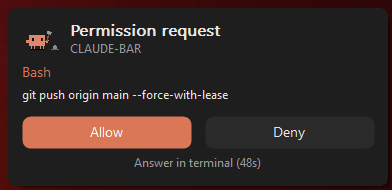
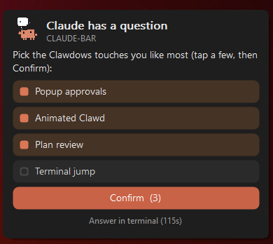
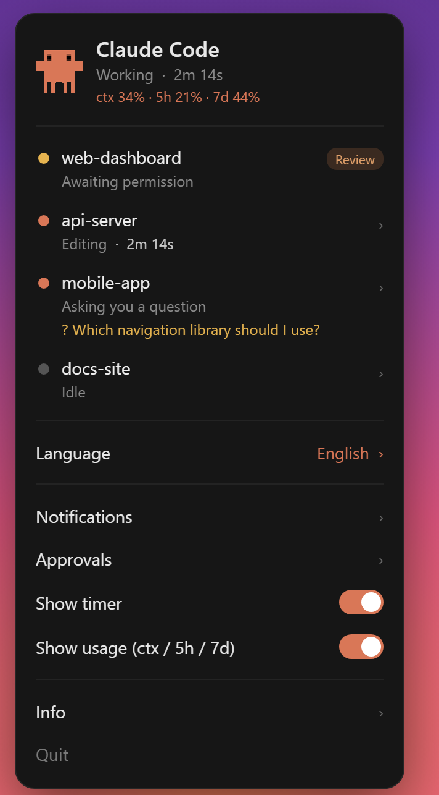
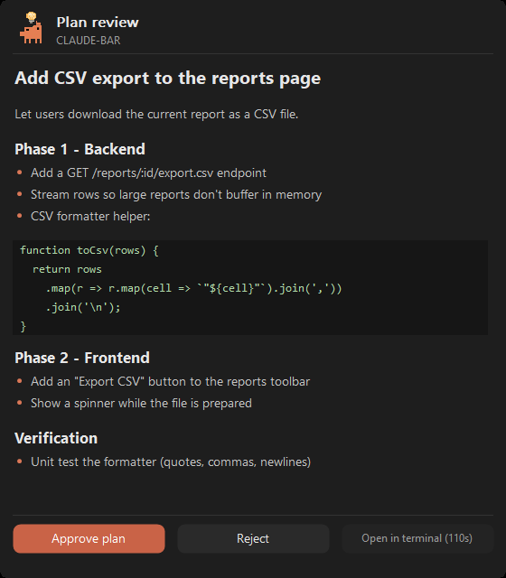
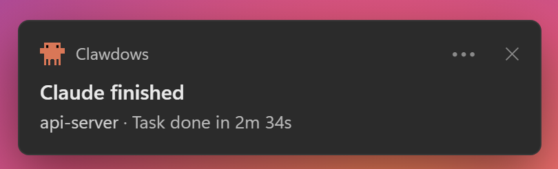

<div align="center">


# Clawdows

**Approve, review and answer Claude Code — right from your Windows tray.**

[](https://claude.com/claude-code)
[](#-install)
[](#-build-from-source)
[](LICENSE)

</div>

**Clawdows** is a tiny native companion for [Claude Code](https://claude.com/claude-code) on Windows.
Clawd walks in your tray while Claude works — and when it needs a permission, a plan or an answer,
a popup lets you respond without leaving your editor. One self-contained **~3.6 MB `.exe`**.

## Features

When Claude needs you, a small Claude-Code-style popup appears next to the tray — answer it in a
click, or ignore it and the normal terminal prompt appears as always. Clawdows never blocks your flow.

- **Permission approvals** — Allow or Deny a tool call from the popup instead of switching windows to press `y`.
- **Plan review** — read Claude's plan rendered with headings, bullets and code, then Approve or Reject.
- **Questions** — answer an `AskUserQuestion` as buttons, single- or multi-select; your choice goes straight back to Claude.
- **Clawd, the tray mascot** — walks while Claude works, rests when it's idle.
- **Multi-session dashboard** — every active Claude Code session with its project, live state and timer.
- **Terminal jump** — click a session to raise its window, whatever it runs in (Windows Terminal, VS Code, Cursor, JetBrains…).
- **Real states** — Editing, Reading, Running, Searching, Browsing, Planning, Sub-agent… recovering cleanly on `Esc`.
- **Usage on hover** — context %, plus 5h / 7d plan usage (no dollar figures).
- **Quiet by default** — an optional gentle chime only when a *long* task finishes, plus an "are you there?" nudge if you step away.
- **Native and tiny** — one self-contained ~3.6 MB `.exe`: no runtime, no Node, no Electron. Installs its own hooks, comes and goes with your sessions, never launches at startup.
- **Three languages** — English, Español, 中文, auto-detected.

> **How can it approve permissions?** Claude Code's `PermissionRequest` hook lets an external
> process decide a permission dialog. The popup writes the decision, the hook passes it back —
> no keystroke injection, no window tricks. If the tray isn't running (or you ignore the popup),
> the normal terminal prompt appears as always.

## What it looks like

Everything happens in the corner — the popup by the tray, the panel from Clawd.

<div align="center">

<table>
  <tr>
    <td align="center" valign="top" width="50%">
      <br>
      <sub><b>Permissions</b> — Allow / Deny, right by the tray</sub>
    </td>
    <td align="center" valign="top" width="50%">
      <br>
      <sub><b>Questions</b> — answer as buttons, multi-select too</sub>
    </td>
  </tr>
  <tr>
    <td align="center" valign="top">
      <br>
      <sub><b>Dashboard</b> — every session, state and timer</sub>
    </td>
    <td align="center" valign="top">
      <br>
      <sub><b>Plan review</b> — rendered, with Approve / Reject</sub>
    </td>
  </tr>
</table>



<sub>A subtle Windows toast when a long task finishes.</sub>

</div>

## 🚀 Install

1. Download **`clawdows.exe`** from the [latest release](../../releases/latest).
2. Put it somewhere permanent, open a terminal there and run:

   ```powershell
   .\clawdows.exe install
   ```

3. Open a **new** Claude Code session. 🦀 Clawd appears and starts following along.

The installer wires Claude Code's hooks into `settings.json` (with a timestamped backup) and, if you
have a custom status line, **preserves it** while adding usage data.

> **Multiple profiles** (e.g. a `claude2` alias with a different `CLAUDE_CONFIG_DIR`)? Install into each:
> ```powershell
> .\clawdows.exe install --config-dir "C:\Users\you\.claude" --config-dir "C:\Users\you\.claude-acc2"
> ```
> **Uninstall:** `.\clawdows.exe uninstall` — removes only its hooks and restores your status line.
> Upgrading from *claude-status-bar*? Just run `.\clawdows.exe install` — it migrates the old hooks automatically.

## 🧩 How it works

Claude Code fires **hooks** at each moment of its work. A tiny, instant invocation of the same `.exe`
writes the current state to a small `state.json`; the tray reads it and draws Clawd. One binary, many hats:

| Command | Role |
|---|---|
| `clawdows` | the tray icon (Clawd) + panel + approval popups |
| `clawdows hook <event>` | writes per-session state (called by the hooks) |
| `clawdows hook permission` | blocks on `PermissionRequest` until you click Allow/Deny (or falls through to the terminal) |
| `clawdows statusline` | feeds usage and passes through your status line |
| `clawdows install` · `uninstall` | wires / unwires everything |

## 🛠️ Build from source

Needs the **.NET 10 SDK** + **Visual C++ build tools** (for the NativeAOT linker).

```powershell
.\build.ps1   # -> .\dist\clawdows.exe
```

CI (GitHub Actions, `windows-latest`) builds and attaches the `.exe` to every tagged release.

## 🙏 Credits

🦀 **Clawd** is from the original macOS project **[m1ckc3s/claude-status-bar](https://github.com/m1ckc3s/claude-status-bar)**
by Mick Cesanek (MIT) — go star it. Windows version & panel by **[@uxKero](https://x.com/uxKero)**.

## 📄 License

[MIT](LICENSE) © uxKero · crab sprite © Mick Cesanek (MIT)

<div align="center">
<sub>Not affiliated with Anthropic. "Claude" and its logo are trademarks of Anthropic.</sub>
</div>
