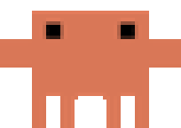
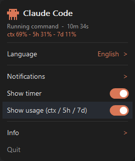
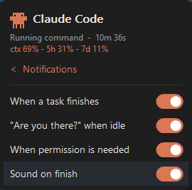

<div align="center">



# Claude Status Bar — for Windows

**Clawd 🦀 walks while Claude Code works.**

[](https://claude.com/claude-code)
[](#-install)
[](#-build-from-source)
[](LICENSE)

</div>

A tiny system-tray indicator for [Claude Code](https://claude.com/claude-code). Glance at the corner
and know what Claude is doing — **Clawd walks while it works, stops when it's done**, and a subtle
toast pings you when a long task finishes. One **~3 MB native `.exe`** — no runtime, no Node.

## ✨ Features

- 🦀 **Clawd, the tray mascot** — walks while Claude is thinking / using tools, idle otherwise.
- 🎯 **Real states** — Editing · Reading · Running a command · Searching · Browsing · Planning · Sub-agent… and recovers correctly on `Esc`.
- 🔔 **Notifications** — silent by default + an optional gentle **chime** only when a *long* task finishes; plus an "are you there?" ping if you walk away.
- 📊 **Usage on hover** — context %, and your 5h / 7d plan usage (no dollar amounts).
- 🎨 **A panel that looks like Claude Code** — dark, rounded, orange accents.
- 🌍 **3 languages** — English · Español · 中文 (auto-detected).
- 🪶 **One self-contained `.exe`** — installs the hooks for you, appears/leaves with your sessions, never starts with Windows.

## 👀 What it looks like

<table>
  <tr>
    <td align="center" valign="top">
      <br>
      <sub>Left-click Clawd → a Claude-Code-style panel</sub>
    </td>
    <td align="center" valign="top">
      <br>
      <sub>Notifications, all configurable</sub>
    </td>
  </tr>
</table>


<sub>A subtle Windows toast when a long task finishes.</sub>

## 🚀 Install

1. Download **`claude-status-bar.exe`** from the [latest release](../../releases/latest).
2. Put it somewhere permanent, open a terminal there and run:

   ```powershell
   .\claude-status-bar.exe install
   ```

3. Open a **new** Claude Code session. 🦀 Clawd appears and starts following along.

The installer wires Claude Code's hooks into `settings.json` (with a timestamped backup) and, if you
have a custom status line, **preserves it** while adding usage data.

> **Multiple profiles** (e.g. a `claude2` alias with a different `CLAUDE_CONFIG_DIR`)? Install into each:
> ```powershell
> .\claude-status-bar.exe install --config-dir "C:\Users\you\.claude" --config-dir "C:\Users\you\.claude-acc2"
> ```
> **Uninstall:** `.\claude-status-bar.exe uninstall` — removes only its hooks and restores your status line.

## 🧩 How it works

Claude Code fires **hooks** at each moment of its work. A tiny, instant invocation of the same `.exe`
writes the current state to a small `state.json`; the tray reads it and draws Clawd. One binary, many hats:

| Command | Role |
|---|---|
| `claude-status-bar` | the tray icon (Clawd) |
| `claude-status-bar hook <event>` | writes `state.json` (called by the hooks) |
| `claude-status-bar statusline` | feeds usage and passes through your status line |
| `claude-status-bar install` · `uninstall` | wires / unwires everything |

## 🛠️ Build from source

Needs the **.NET 10 SDK** + **Visual C++ build tools** (for the NativeAOT linker).

```powershell
.\build.ps1   # -> .\dist\claude-status-bar.exe
```

CI (GitHub Actions, `windows-latest`) builds and attaches the `.exe` to every tagged release.

## 🙏 Credits

🦀 **Clawd** is from the original macOS project **[m1ckc3s/claude-status-bar](https://github.com/m1ckc3s/claude-status-bar)**
by Mick Cesanek (MIT) — go star it. Windows version & panel by **[@uxKero](https://x.com/uxKero)**.

## 📄 License

[MIT](LICENSE) © uxKero · crab sprite © Mick Cesanek (MIT)

<div align="center">
<sub>Not affiliated with Anthropic. "Claude" and its logo are trademarks of Anthropic.</sub>
</div>
